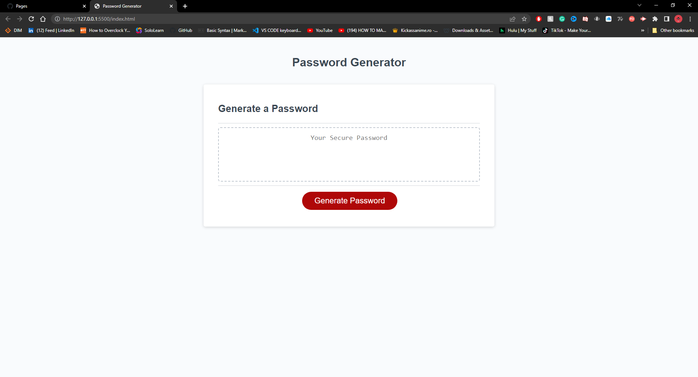
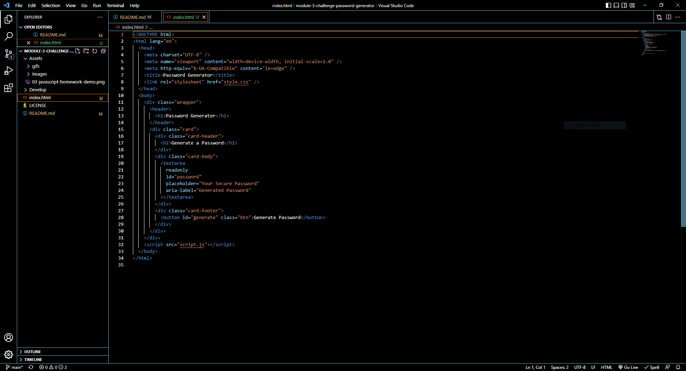
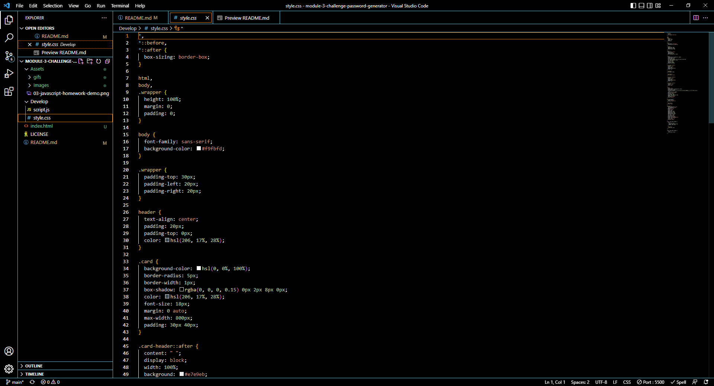
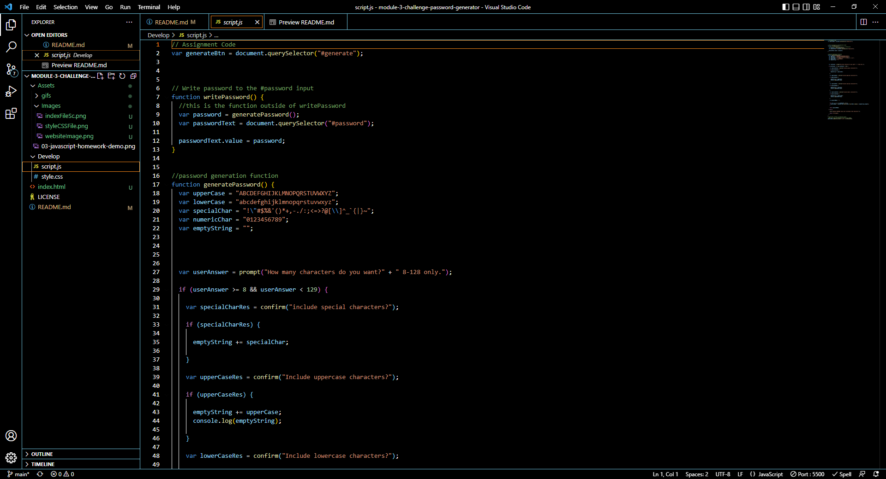

# Module 03 Challenge JavaScript: Password Generator
## -->[Link to the Deployed page](https://thvt1guy.github.io/module-3-challenge-password-generator/)<--

## Changes made to the starter code
- Website now gives password based on the criteria given.
- Website gives feedback and confirmation when information is inputted wrong.
- Moved index.html file to main file so the website can load properly.
- Added link to deployed page.
- Added website image, gif, and file screenshots to README.md file.

## WEBSITE PAGE GIF

## HTML FILE IMAGE

## CSS FILE IMAGE

## JavaScript FILE IMAGE

